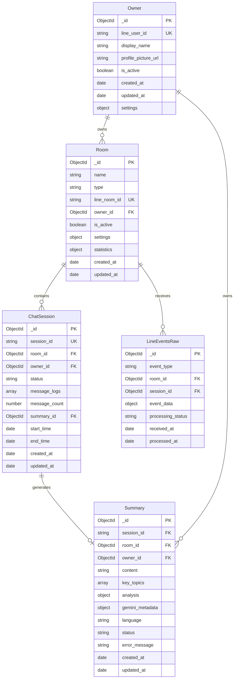
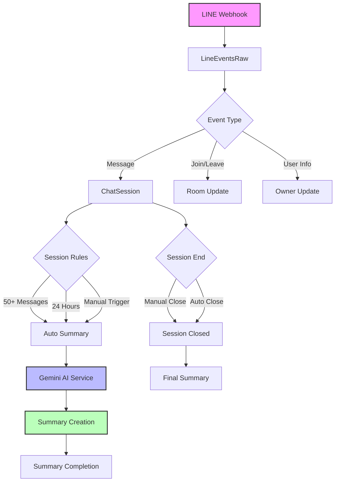
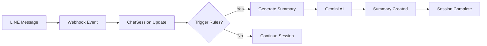

# Database Documentation - LINE Chat Summarizer AI

## Overview

The LINE Chat Summarizer AI uses MongoDB with Mongoose ODM to manage chat sessions, AI summaries, rooms, and user data for LINE bot integration.

## Database Schema Relationships (ASCII Diagram)

```
┌─────────────┐       ┌─────────────┐       ┌─────────────┐       ┌─────────────┐
│    Owner    │ 1───N │    Room     │ 1───N │ ChatSession │ 1───1 │   Summary   │
├─────────────┤       ├─────────────┤       ├─────────────┤       ├─────────────┤
│ _id (PK)    │       │ _id (PK)    │       │ _id (PK)    │       │ _id (PK)    │
│ line_user_id│       │ name        │       │ session_id  │       │ session_id  │
│ display_name│       │ type        │       │ room_id (FK)│       │ room_id (FK)│
│ profile_pic │       │ line_room_id│       │ owner_id(FK)│       │ owner_id(FK)│
│ is_active   │       │ owner_id(FK)│       │ status      │       │ content     │
│ created_at  │       │ is_active   │       │ message_logs│       │ key_topics  │
│ settings    │       │ settings    │       │ msg_count   │       │ analysis    │
└─────────────┘       │ statistics  │       │ summary_id  │       │ gemini_meta │
                      │ created_at  │       │ start_time  │       │ language    │
                      └─────────────┘       │ end_time    │       │ status      │
                             │              └─────────────┘       │ error_msg   │
                             │                                    │ created_at  │
                             │ 1                                  └─────────────┘
                             │
                             │ N
                      ┌─────────────┐
                      │LineEventsRaw│
                      ├─────────────┤
                      │ _id (PK)    │
                      │ event_type  │
                      │ room_id (FK)│
                      │ session_id  │
                      │ event_data  │
                      │ proc_status │
                      │ received_at │
                      │ processed_at│
                      └─────────────┘
```

## Process Flow

```
LINE Message
     ↓
Webhook Event (LineEventsRaw)
     ↓
Event Processing
     ↓
ChatSession Update
     ↓
Check Triggers (50+ msgs OR 24 hours OR manual)
     ↓
Generate Summary (Gemini AI)
     ↓
Summary Created
     ↓
Session Complete
```

## Mermaid Diagrams (for Mermaid-compatible viewers)

### Entity Relationship Diagram



### Data Flow Diagram



### Simple Process Flow



## Collections Overview

### 🏢 owners
- **Purpose**: LINE user accounts and profiles
- **Collection**: `owners`
- **Key Fields**:
  - `line_user_id` (string, unique) - LINE user identifier
  - `display_name` (string) - User's display name
  - `profile_picture_url` (string) - Profile image URL
  - `is_active` (boolean) - Account status
  - `settings` (object) - User preferences
- **Indexes**: `line_user_id` (unique), `created_at`

### 🏠 rooms
- **Purpose**: Individual and group chat rooms
- **Collection**: `rooms`
- **Key Fields**:
  - `name` (string) - Room name
  - `type` (string) - "individual" or "group"
  - `line_room_id` (string, unique) - LINE room identifier
  - `owner_id` (ObjectId) - Reference to owner
  - `is_active` (boolean) - Room status
  - `settings` (object) - Auto-summarization settings
  - `statistics` (object) - Usage statistics
- **Indexes**: `line_room_id` (unique), `owner_id`, `is_active`

### 💬 chatsessions
- **Purpose**: Active conversation sessions with messages
- **Collection**: `chatsessions`
- **Key Fields**:
  - `session_id` (string, unique) - Session identifier
  - `room_id` (ObjectId) - Reference to room
  - `owner_id` (ObjectId) - Reference to owner
  - `status` (string) - "active", "closed", "summarizing"
  - `message_logs` (array) - Chat messages
  - `message_count` (number) - Total message count
  - `summary_id` (ObjectId) - Reference to summary
  - `start_time` (date) - Session start
  - `end_time` (date) - Session end
- **Indexes**: `session_id` (unique), `room_id`, `status`, `start_time`

### 🤖 summaries
- **Purpose**: AI-generated conversation summaries
- **Collection**: `summaries`
- **Key Fields**:
  - `session_id` (string) - Reference to session
  - `room_id` (ObjectId) - Reference to room
  - `owner_id` (ObjectId) - Reference to owner
  - `content` (string) - AI-generated summary content
  - `key_topics` (array) - Extracted topics
  - `analysis` (object) - Sentiment, urgency, category
  - `gemini_metadata` (object) - AI model metadata
  - `language` (string) - Summary language
  - `status` (string) - "processing", "completed", "failed"
- **Indexes**: `session_id`, `room_id`, `owner_id`, `status`, `created_at`

### 📋 lineeventsraw
- **Purpose**: Raw LINE webhook events for debugging
- **Collection**: `lineeventsraw`
- **Key Fields**:
  - `event_type` (string) - Type of LINE event
  - `room_id` (ObjectId) - Reference to room
  - `session_id` (ObjectId) - Reference to session
  - `event_data` (object) - Raw event payload
  - `processing_status` (string) - Processing state
  - `received_at` (date) - Event received time
  - `processed_at` (date) - Event processed time
- **Indexes**: `event_type`, `room_id`, `received_at`

## Key Business Logic

### Session Lifecycle
1. **Start**: First message in room creates new session
2. **Active**: Messages logged to `message_logs` array
3. **Triggers**: Auto-summary triggered by:
   - 50+ messages in session
   - 24 hours since session start
   - Manual admin trigger
4. **Summarization**: Status changes to "summarizing"
5. **End**: Session status changes to "closed"

### Summary Generation Process
1. **Trigger**: Automatic or manual via tRPC API
2. **Validation**: Minimum 1 message required (configurable)
3. **AI Processing**: Gemini 1.5 Flash analyzes message logs
4. **Content Generation**:
   - Summary text
   - Key topics extraction
   - Sentiment analysis (positive/neutral/negative)
   - Urgency level (low/medium/high)
   - Action items identification
5. **Storage**: Summary linked to session, room, and owner

### Data Relationships
- **Owner → Room** (1:Many) - One user owns multiple rooms
- **Room → ChatSession** (1:Many) - One room has multiple sessions over time
- **ChatSession → Summary** (1:One) - Each session gets one final summary
- **Owner → Summary** (1:Many) - One user owns summaries from all their rooms
- **Room → LineEventsRaw** (1:Many) - All events logged per room

## tRPC API Integration

The schemas integrate with tRPC API endpoints:

### Sessions API (`/api/trpc/sessions.*`)
- `sessions.list` - Get paginated sessions with filters
- `sessions.get` - Get single session with details
- `sessions.close` - Close active session (admin only)
- `sessions.generateSummary` - Generate summary manually (admin only)
- `sessions.stats` - Get session statistics

### Summaries API (`/api/trpc/summaries.*`)
- `summaries.list` - Get paginated summaries
- `summaries.get` - Get single summary
- `summaries.byRoom` - Get summaries for specific room
- `summaries.stats` - Get summary statistics
- `summaries.export` - Export summary data

### Rooms API (`/api/trpc/rooms.*`)
- `rooms.list` - Get paginated rooms
- `rooms.get` - Get single room with sessions
- `rooms.withActiveSessions` - Get rooms with active sessions
- `rooms.updateSettings` - Update room settings (admin only)
- `rooms.archive` - Archive room (admin only)
- `rooms.stats` - Get room statistics

## File Structure

```
backend/src/models/
├── index.js              # Model exports and relationships
├── owner.js              # Owner/user schema
├── room.js               # Room/channel schema
├── chat_session.js       # Session management schema
├── summary.js            # AI summary schema
└── line_events_raw.js    # Event logging schema
```

## Database Configuration

- **Database Name**: `line_chat_summarizer`
- **Connection**: MongoDB (Atlas or local instance)
- **ODM**: Mongoose for schema definition and validation
- **Indexing**: Automatic index creation on server startup
- **Connection String**: Configured via environment variables

## Environment Setup

Required environment variables:
- `MONGODB_URI` - MongoDB connection string
- `GEMINI_API_KEY` - Google Gemini API key for AI summaries
- `LINE_CHANNEL_ACCESS_TOKEN` - LINE Bot API token
- `LINE_CHANNEL_SECRET` - LINE Bot webhook secret

## Schema Features

### Validation
- Required fields enforced at schema level
- Enum constraints for status fields
- Custom validation methods for business rules

### Middleware
- Pre-save hooks for logging and timestamps
- Post-save hooks for related data updates
- Index creation and maintenance

### Methods
- Instance methods for business operations
- Static methods for complex queries
- Utility methods for data formatting

### Relationships
- Population of related documents
- Cascade operations for data consistency
- Reference integrity maintained through application logic