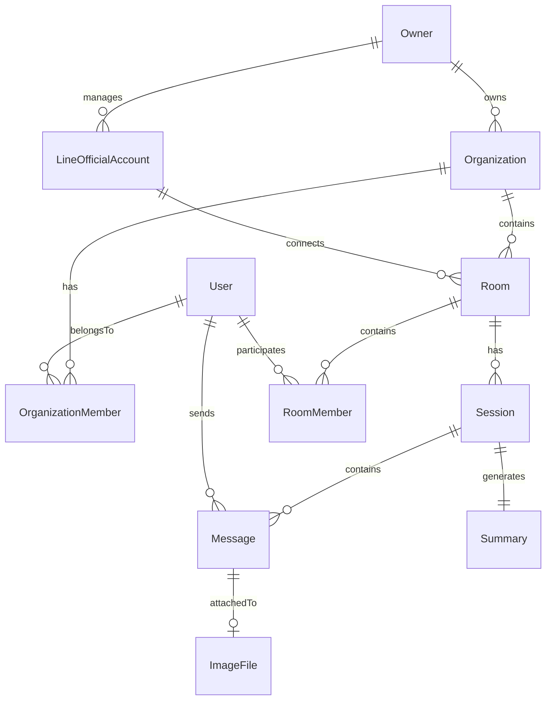

# Database Schema Design - Multi-Tenant LINE Chat Summarizer

## Overview
This document outlines the MongoDB database schema design for handling separate chats for each room and organization by LINE Official Account owner. The system supports multi-tenant architecture where each LINE OA owner can manage multiple organizations and rooms.

## Entity Relationship Diagram



## Database Collections Structure

### 1. Owners Collection
```typescript
// server/db/models/Owner.ts
interface Owner {
  _id: ObjectId;
  email: string;                    // Owner's email (unique)
  name: string;                      // Owner's full name
  phoneNumber?: string;              // Contact number
  plan: 'free' | 'basic' | 'pro' | 'enterprise';
  lineOfficialAccounts: ObjectId[]; // References to LineOfficialAccount
  organizations: ObjectId[];        // References to Organization
  settings: {
    language: string;
    timezone: string;
    notifications: boolean;
  };
  subscription: {
    status: 'active' | 'inactive' | 'suspended';
    startDate: Date;
    endDate?: Date;
    billingCycle?: 'monthly' | 'yearly';
  };
  usage: {
    totalMessages: number;
    totalSessions: number;
    totalSummaries: number;
    geminiTokensUsed: number;
    storageUsedMB: number;
  };
  createdAt: Date;
  updatedAt: Date;
}
```

### 2. Organizations Collection
```typescript
// server/db/models/Organization.ts
interface Organization {
  _id: ObjectId;
  ownerId: ObjectId;                // Reference to Owner
  name: string;                      // Organization name
  description?: string;
  type: 'business' | 'education' | 'healthcare' | 'retail' | 'other';
  settings: {
    autoSummarize: boolean;
    summarySchedule?: 'daily' | 'weekly' | 'monthly';
    sessionTriggers: {
      messageCount: number;          // Default: 50
      timeLimit: number;             // Default: 24 hours (in ms)
    };
    aiSettings: {
      model: 'gemini-1.5-pro' | 'gemini-1.5-flash';
      summaryLanguage: string;
      summaryStyle: 'brief' | 'detailed' | 'bullet_points';
    };
  };
  members: ObjectId[];               // References to OrganizationMember
  rooms: ObjectId[];                 // References to Room
  metadata: {
    industry?: string;
    size?: 'small' | 'medium' | 'large' | 'enterprise';
    website?: string;
  };
  limits: {
    maxRooms: number;
    maxMembersPerRoom: number;
    maxMessagesPerMonth: number;
    maxStorageGB: number;
  };
  billing?: {
    customerId?: string;             // Stripe/Payment gateway ID
    subscriptionId?: string;
  };
  status: 'active' | 'inactive' | 'suspended';
  createdAt: Date;
  updatedAt: Date;
}
```

### 3. LINE Official Accounts Collection
```typescript
// server/db/models/LineOfficialAccount.ts
interface LineOfficialAccount {
  _id: ObjectId;
  ownerId: ObjectId;                // Reference to Owner
  channelId: string;                // LINE Channel ID (unique)
  channelSecret: string;            // Encrypted
  channelAccessToken: string;       // Encrypted
  name: string;                     // OA Display name
  pictureUrl?: string;
  description?: string;
  webhookUrl: string;               // Configured webhook endpoint
  webhookVerified: boolean;
  features: {
    messaging: boolean;
    richMenu: boolean;
    broadcast: boolean;
  };
  connectedRooms: ObjectId[];       // References to Room
  statistics: {
    totalUsers: number;
    activeUsers: number;
    messagesReceived: number;
    messagesSent: number;
  };
  status: 'active' | 'inactive' | 'pending_verification';
  verifiedAt?: Date;
  createdAt: Date;
  updatedAt: Date;
}
```

### 4. Rooms Collection
```typescript
// server/db/models/Room.ts
interface Room {
  _id: ObjectId;
  organizationId: ObjectId;         // Reference to Organization
  lineOfficialAccountId: ObjectId;  // Reference to LineOfficialAccount
  roomType: 'individual' | 'group' | 'multi_person';
  lineRoomId?: string;              // LINE's room ID for group chats
  lineGroupId?: string;             // LINE's group ID
  name: string;                     // Room display name
  description?: string;
  avatar?: string;
  members: ObjectId[];              // References to RoomMember
  admins: ObjectId[];              // References to User (room admins)
  settings: {
    autoClose: boolean;
    sessionTriggers: {
      messageCount: number;         // Override org default
      timeLimit: number;            // Override org default
    };
    aiEnabled: boolean;
    notificationEnabled: boolean;
    privacy: 'public' | 'private';
  };
  metadata: {
    purpose?: string;               // Customer support, Sales, etc.
    department?: string;
    tags?: string[];
    customFields?: Record<string, any>;
  };
  statistics: {
    totalSessions: number;
    totalMessages: number;
    totalImages: number;
    activeSessions: number;
    lastActivityAt: Date;
  };
  status: 'active' | 'archived' | 'deleted';
  archivedAt?: Date;
  createdAt: Date;
  updatedAt: Date;
}
```

### 5. Room Members Collection
```typescript
// server/db/models/RoomMember.ts
interface RoomMember {
  _id: ObjectId;
  roomId: ObjectId;                 // Reference to Room
  userId: ObjectId;                 // Reference to User
  role: 'admin' | 'member' | 'viewer';
  joinedAt: Date;
  lastActiveAt: Date;
  permissions: {
    canSendMessage: boolean;
    canViewHistory: boolean;
    canExportData: boolean;
    canManageSettings: boolean;
  };
  statistics: {
    messagesSent: number;
    sessionsParticipated: number;
  };
  status: 'active' | 'inactive' | 'banned';
  bannedAt?: Date;
  bannedReason?: string;
  createdAt: Date;
  updatedAt: Date;
}
```

### 6. Organization Members Collection
```typescript
// server/db/models/OrganizationMember.ts
interface OrganizationMember {
  _id: ObjectId;
  organizationId: ObjectId;         // Reference to Organization
  userId: ObjectId;                 // Reference to User
  role: 'owner' | 'admin' | 'manager' | 'member' | 'viewer';
  permissions: {
    canCreateRooms: boolean;
    canManageMembers: boolean;
    canViewAnalytics: boolean;
    canExportData: boolean;
    canManageSettings: boolean;
    canManageBilling: boolean;
  };
  departmentId?: ObjectId;
  title?: string;
  joinedAt: Date;
  invitedBy?: ObjectId;             // Reference to User who invited
  status: 'active' | 'inactive' | 'pending' | 'suspended';
  createdAt: Date;
  updatedAt: Date;
}
```

### 7. Users Collection (Updated)
```typescript
// server/db/models/User.ts
interface User {
  _id: ObjectId;
  lineUserId: string;                // LINE User ID (unique)
  displayName: string;
  pictureUrl?: string;
  email?: string;
  phoneNumber?: string;
  profile: {
    firstName?: string;
    lastName?: string;
    language: string;
    timezone: string;
  };
  organizations: ObjectId[];         // References to Organization
  rooms: ObjectId[];                // References to Room
  preferences: {
    notifications: {
      email: boolean;
      line: boolean;
      summary: boolean;
    };
    privacy: {
      shareProfile: boolean;
      shareActivity: boolean;
    };
  };
  statistics: {
    totalMessages: number;
    totalSessions: number;
    totalRooms: number;
    lastActiveAt: Date;
  };
  metadata: {
    source: 'line' | 'web' | 'api';
    tags?: string[];
    customerId?: string;             // For CRM integration
    customFields?: Record<string, any>;
  };
  status: 'active' | 'inactive' | 'suspended';
  createdAt: Date;
  updatedAt: Date;
}
```

### 8. Sessions Collection (Updated)
```typescript
// server/db/models/Session.ts
interface Session {
  _id: ObjectId;
  roomId: ObjectId;                 // Reference to Room
  organizationId: ObjectId;         // Reference to Organization (denormalized)
  sessionNumber: number;            // Sequential number within room
  participants: ObjectId[];         // References to User
  status: 'active' | 'closed' | 'summarizing';
  trigger: 'message_count' | 'time_limit' | 'manual';
  startTime: Date;
  endTime?: Date;
  statistics: {
    messageCount: number;
    imageCount: number;
    participantCount: number;
    duration?: number;               // in milliseconds
  };
  summary?: ObjectId;               // Reference to Summary
  aiAnalysis?: {
    sentiment: 'positive' | 'neutral' | 'negative';
    urgency: 'low' | 'medium' | 'high';
    category?: string;
    topics?: string[];
  };
  metadata: {
    platform: 'line';
    clientInfo?: {
      userAgent?: string;
      ipAddress?: string;
    };
  };
  closedBy?: ObjectId;              // Reference to User who closed manually
  createdAt: Date;
  updatedAt: Date;
}
```

### 9. Messages Collection (Updated)
```typescript
// server/db/models/Message.ts
interface Message {
  _id: ObjectId;
  sessionId: ObjectId;              // Reference to Session
  roomId: ObjectId;                 // Reference to Room (denormalized)
  organizationId: ObjectId;         // Reference to Organization (denormalized)
  userId: ObjectId;                 // Reference to User (sender)
  lineMessageId: string;            // LINE's message ID (unique)
  replyToken?: string;              // For LINE reply
  messageType: 'text' | 'image' | 'video' | 'audio' | 'file' | 'sticker' | 'location';
  content?: string;                 // Text content
  imageData?: {
    gridFSId: ObjectId;             // Reference to GridFS
    originalUrl: string;
    previewUrl: string;
    fileName: string;
    fileSize: number;
    mimeType: string;
    dimensions?: {
      width: number;
      height: number;
    };
    thumbnailGridFSId?: ObjectId;
    geminiAnalysis?: {
      description: string;
      objects?: string[];
      text?: string;               // OCR result
      nsfw?: boolean;
      analyzedAt: Date;
    };
  };
  stickerData?: {
    packageId: string;
    stickerId: string;
  };
  locationData?: {
    title?: string;
    address?: string;
    latitude: number;
    longitude: number;
  };
  metadata: {
    isForwarded?: boolean;
    originalMessageId?: string;
    mentions?: ObjectId[];          // References to mentioned Users
    hashtags?: string[];
    urls?: string[];
  };
  aiProcessing?: {
    translated?: {
      language: string;
      text: string;
    };
    sentiment?: 'positive' | 'neutral' | 'negative';
    intent?: string;
    entities?: Array<{
      type: string;
      value: string;
    }>;
  };
  status: 'delivered' | 'read' | 'failed' | 'deleted';
  deliveredAt?: Date;
  readAt?: Date;
  deletedAt?: Date;
  timestamp: Date;
  createdAt: Date;
}
```

### 10. Summaries Collection (Updated)
```typescript
// server/db/models/Summary.ts
interface Summary {
  _id: ObjectId;
  sessionId: ObjectId;              // Reference to Session
  roomId: ObjectId;                 // Reference to Room (denormalized)
  organizationId: ObjectId;         // Reference to Organization (denormalized)
  generatedBy: 'system' | 'manual' | 'scheduled';
  triggeredBy?: ObjectId;           // Reference to User if manual
  content: {
    brief: string;                  // Brief summary
    detailed?: string;              // Detailed summary
    bulletPoints?: string[];        // Key points
    actionItems?: Array<{
      item: string;
      assignedTo?: string;
      priority: 'low' | 'medium' | 'high';
      deadline?: Date;
    }>;
  };
  analysis: {
    keyTopics: string[];
    sentiment: 'positive' | 'neutral' | 'negative';
    emotions?: string[];
    category?: string;
    tags?: string[];
    imageInsights?: string[];
  };
  participants: Array<{
    userId: ObjectId;
    messageCount: number;
    sentiment: string;
    keyPoints?: string[];
  }>;
  geminiMetadata: {
    model: string;
    tokensUsed: number;
    processingTime: number;         // in milliseconds
    cost?: number;
    error?: string;
  };
  language: string;
  visibility: 'private' | 'room' | 'organization';
  exports?: Array<{
    format: 'pdf' | 'json' | 'csv' | 'docx';
    exportedAt: Date;
    exportedBy: ObjectId;
    url?: string;
  }>;
  feedback?: {
    rating?: number;                // 1-5
    comment?: string;
    ratedBy?: ObjectId;
    ratedAt?: Date;
  };
  status: 'draft' | 'processing' | 'completed' | 'failed';
  scheduledFor?: Date;
  completedAt?: Date;
  createdAt: Date;
  updatedAt: Date;
}
```

## File Structure for Database Models

```
server/
├── db/
│   ├── models/
│   │   ├── owner/
│   │   │   ├── Owner.model.ts
│   │   │   ├── Owner.schema.ts
│   │   │   └── Owner.methods.ts
│   │   ├── organization/
│   │   │   ├── Organization.model.ts
│   │   │   ├── Organization.schema.ts
│   │   │   ├── Organization.methods.ts
│   │   │   └── Organization.hooks.ts
│   │   ├── line/
│   │   │   ├── LineOfficialAccount.model.ts
│   │   │   ├── LineOfficialAccount.schema.ts
│   │   │   └── LineOfficialAccount.methods.ts
│   │   ├── room/
│   │   │   ├── Room.model.ts
│   │   │   ├── Room.schema.ts
│   │   │   ├── Room.methods.ts
│   │   │   ├── RoomMember.model.ts
│   │   │   └── RoomMember.schema.ts
│   │   ├── user/
│   │   │   ├── User.model.ts
│   │   │   ├── User.schema.ts
│   │   │   ├── User.methods.ts
│   │   │   ├── OrganizationMember.model.ts
│   │   │   └── OrganizationMember.schema.ts
│   │   ├── session/
│   │   │   ├── Session.model.ts
│   │   │   ├── Session.schema.ts
│   │   │   ├── Session.methods.ts
│   │   │   └── Session.hooks.ts
│   │   ├── message/
│   │   │   ├── Message.model.ts
│   │   │   ├── Message.schema.ts
│   │   │   ├── Message.methods.ts
│   │   │   └── Message.virtuals.ts
│   │   ├── summary/
│   │   │   ├── Summary.model.ts
│   │   │   ├── Summary.schema.ts
│   │   │   ├── Summary.methods.ts
│   │   │   └── Summary.hooks.ts
│   │   └── index.ts
│   ├── repositories/
│   │   ├── OwnerRepository.ts
│   │   ├── OrganizationRepository.ts
│   │   ├── RoomRepository.ts
│   │   ├── SessionRepository.ts
│   │   ├── MessageRepository.ts
│   │   ├── SummaryRepository.ts
│   │   └── index.ts
│   ├── services/
│   │   ├── DatabaseService.ts
│   │   ├── MigrationService.ts
│   │   ├── SeedService.ts
│   │   └── BackupService.ts
│   ├── migrations/
│   │   ├── 001_initial_schema.ts
│   │   ├── 002_add_organizations.ts
│   │   └── 003_add_multi_tenant.ts
│   ├── seeds/
│   │   ├── development.seed.ts
│   │   ├── test.seed.ts
│   │   └── demo.seed.ts
│   └── connection.ts
```

## Implementation Examples

### Owner Model Implementation
```typescript
// server/db/models/owner/Owner.schema.ts
import mongoose, { Schema } from 'mongoose';
import { Owner } from './Owner.model';

const OwnerSchema = new Schema<Owner>({
  email: {
    type: String,
    required: true,
    unique: true,
    lowercase: true,
    trim: true
  },
  name: {
    type: String,
    required: true
  },
  phoneNumber: String,
  plan: {
    type: String,
    enum: ['free', 'basic', 'pro', 'enterprise'],
    default: 'free'
  },
  lineOfficialAccounts: [{
    type: Schema.Types.ObjectId,
    ref: 'LineOfficialAccount'
  }],
  organizations: [{
    type: Schema.Types.ObjectId,
    ref: 'Organization'
  }],
  settings: {
    language: { type: String, default: 'en' },
    timezone: { type: String, default: 'UTC' },
    notifications: { type: Boolean, default: true }
  },
  subscription: {
    status: {
      type: String,
      enum: ['active', 'inactive', 'suspended'],
      default: 'active'
    },
    startDate: { type: Date, default: Date.now },
    endDate: Date,
    billingCycle: {
      type: String,
      enum: ['monthly', 'yearly']
    }
  },
  usage: {
    totalMessages: { type: Number, default: 0 },
    totalSessions: { type: Number, default: 0 },
    totalSummaries: { type: Number, default: 0 },
    geminiTokensUsed: { type: Number, default: 0 },
    storageUsedMB: { type: Number, default: 0 }
  }
}, {
  timestamps: true,
  collection: 'owners'
});

// Indexes
OwnerSchema.index({ email: 1 });
OwnerSchema.index({ 'subscription.status': 1 });
OwnerSchema.index({ createdAt: -1 });

export default mongoose.model<Owner>('Owner', OwnerSchema);
```

### Room Model with Methods
```typescript
// server/db/models/room/Room.methods.ts
import { Room } from './Room.model';
import Session from '../session/Session.model';
import Message from '../message/Message.model';

export class RoomMethods {
  /**
   * Get active session for the room
   */
  static async getActiveSession(roomId: string) {
    return await Session.findOne({
      roomId,
      status: 'active'
    });
  }

  /**
   * Create new session for the room
   */
  static async createSession(roomId: string) {
    const room = await this.findById(roomId);
    if (!room) throw new Error('Room not found');

    const sessionCount = await Session.countDocuments({ roomId });

    return await Session.create({
      roomId,
      organizationId: room.organizationId,
      sessionNumber: sessionCount + 1,
      status: 'active',
      startTime: new Date(),
      participants: [],
      statistics: {
        messageCount: 0,
        imageCount: 0,
        participantCount: 0
      }
    });
  }

  /**
   * Archive room and all its sessions
   */
  static async archiveRoom(roomId: string) {
    const room = await this.findById(roomId);
    if (!room) throw new Error('Room not found');

    // Close all active sessions
    await Session.updateMany(
      { roomId, status: 'active' },
      {
        status: 'closed',
        endTime: new Date(),
        trigger: 'manual'
      }
    );

    // Archive the room
    room.status = 'archived';
    room.archivedAt = new Date();
    await room.save();

    return room;
  }

  /**
   * Get room statistics
   */
  static async getRoomStatistics(roomId: string) {
    const sessions = await Session.find({ roomId });
    const messages = await Message.countDocuments({ roomId });
    const images = await Message.countDocuments({
      roomId,
      messageType: 'image'
    });

    return {
      totalSessions: sessions.length,
      activeSessions: sessions.filter(s => s.status === 'active').length,
      totalMessages: messages,
      totalImages: images,
      avgMessagesPerSession: messages / (sessions.length || 1)
    };
  }
}
```

### Organization Repository
```typescript
// server/db/repositories/OrganizationRepository.ts
import Organization from '../models/organization/Organization.model';
import Room from '../models/room/Room.model';
import { Types } from 'mongoose';

export class OrganizationRepository {
  /**
   * Create organization with default room
   */
  async createOrganization(ownerId: string, data: Partial<Organization>) {
    const session = await mongoose.startSession();
    session.startTransaction();

    try {
      // Create organization
      const org = await Organization.create([{
        ownerId: new Types.ObjectId(ownerId),
        ...data,
        status: 'active'
      }], { session });

      // Create default room
      const defaultRoom = await Room.create([{
        organizationId: org[0]._id,
        name: 'General',
        roomType: 'group',
        settings: {
          autoClose: true,
          sessionTriggers: {
            messageCount: 50,
            timeLimit: 24 * 60 * 60 * 1000
          },
          aiEnabled: true,
          notificationEnabled: true,
          privacy: 'private'
        }
      }], { session });

      // Update organization with room reference
      org[0].rooms.push(defaultRoom[0]._id);
      await org[0].save({ session });

      await session.commitTransaction();
      return org[0];
    } catch (error) {
      await session.abortTransaction();
      throw error;
    } finally {
      session.endSession();
    }
  }

  /**
   * Get organization with populated data
   */
  async getOrganizationDetails(orgId: string) {
    return await Organization.findById(orgId)
      .populate('ownerId', 'name email')
      .populate('rooms', 'name roomType status')
      .populate('members', 'userId role status')
      .lean();
  }

  /**
   * Get organizations by owner
   */
  async getOrganizationsByOwner(ownerId: string) {
    return await Organization.find({
      ownerId: new Types.ObjectId(ownerId),
      status: 'active'
    })
    .sort({ createdAt: -1 })
    .lean();
  }

  /**
   * Update organization usage
   */
  async updateUsage(orgId: string, field: string, increment: number = 1) {
    return await Organization.findByIdAndUpdate(
      orgId,
      { $inc: { [`usage.${field}`]: increment } },
      { new: true }
    );
  }
}
```

## Database Indexes

```typescript
// server/db/services/DatabaseService.ts
export class DatabaseService {
  async createIndexes() {
    // Owner indexes
    await Owner.collection.createIndex({ email: 1 }, { unique: true });
    await Owner.collection.createIndex({ 'subscription.status': 1 });

    // Organization indexes
    await Organization.collection.createIndex({ ownerId: 1 });
    await Organization.collection.createIndex({ status: 1 });
    await Organization.collection.createIndex({ name: 'text' });

    // LINE OA indexes
    await LineOfficialAccount.collection.createIndex({ channelId: 1 }, { unique: true });
    await LineOfficialAccount.collection.createIndex({ ownerId: 1 });

    // Room indexes
    await Room.collection.createIndex({ organizationId: 1 });
    await Room.collection.createIndex({ lineOfficialAccountId: 1 });
    await Room.collection.createIndex({ lineRoomId: 1 });
    await Room.collection.createIndex({ status: 1 });
    await Room.collection.createIndex({ 'statistics.lastActivityAt': -1 });

    // Session indexes
    await Session.collection.createIndex({ roomId: 1, status: 1 });
    await Session.collection.createIndex({ organizationId: 1 });
    await Session.collection.createIndex({ startTime: -1 });

    // Message indexes
    await Message.collection.createIndex({ sessionId: 1 });
    await Message.collection.createIndex({ roomId: 1 });
    await Message.collection.createIndex({ organizationId: 1 });
    await Message.collection.createIndex({ lineMessageId: 1 }, { unique: true });
    await Message.collection.createIndex({ userId: 1 });
    await Message.collection.createIndex({ timestamp: -1 });

    // Summary indexes
    await Summary.collection.createIndex({ sessionId: 1 });
    await Summary.collection.createIndex({ roomId: 1 });
    await Summary.collection.createIndex({ organizationId: 1 });
    await Summary.collection.createIndex({ status: 1 });
    await Summary.collection.createIndex({ createdAt: -1 });

    // User indexes
    await User.collection.createIndex({ lineUserId: 1 }, { unique: true });
    await User.collection.createIndex({ email: 1 }, { sparse: true });
    await User.collection.createIndex({ organizations: 1 });
    await User.collection.createIndex({ rooms: 1 });

    // Compound indexes for common queries
    await Message.collection.createIndex({ roomId: 1, timestamp: -1 });
    await Session.collection.createIndex({ roomId: 1, sessionNumber: -1 });
    await Summary.collection.createIndex({ roomId: 1, createdAt: -1 });
  }
}
```

## Migration Example

```typescript
// server/db/migrations/002_add_organizations.ts
export async function up() {
  // Add organizationId to existing collections
  await Session.updateMany(
    { organizationId: { $exists: false } },
    { $set: { organizationId: null } }
  );

  await Message.updateMany(
    { organizationId: { $exists: false } },
    { $set: { organizationId: null } }
  );

  await Summary.updateMany(
    { organizationId: { $exists: false } },
    { $set: { organizationId: null } }
  );
}

export async function down() {
  // Remove organizationId from collections
  await Session.updateMany(
    {},
    { $unset: { organizationId: "" } }
  );

  await Message.updateMany(
    {},
    { $unset: { organizationId: "" } }
  );

  await Summary.updateMany(
    {},
    { $unset: { organizationId: "" } }
  );
}
```

## Security Considerations

1. **Data Isolation**: Each organization's data is isolated by organizationId
2. **Access Control**: Role-based permissions at organization and room levels
3. **Encryption**: Sensitive data like channel secrets are encrypted
4. **Audit Trail**: Track all actions with timestamps and user references
5. **Data Retention**: Implement policies for data archival and deletion
6. **Rate Limiting**: Per-organization rate limits to prevent abuse

## Performance Optimizations

1. **Denormalization**: Store organizationId and roomId in messages for faster queries
2. **Compound Indexes**: Create indexes for common query patterns
3. **Aggregation Pipeline**: Use MongoDB aggregation for analytics
4. **Caching**: Cache frequently accessed data (room members, org settings)
5. **Pagination**: Implement cursor-based pagination for large datasets
6. **Archival**: Move old data to archive collections

## Backup and Recovery Strategy

```typescript
// server/db/services/BackupService.ts
export class BackupService {
  async backupOrganization(orgId: string) {
    const data = {
      organization: await Organization.findById(orgId),
      rooms: await Room.find({ organizationId: orgId }),
      sessions: await Session.find({ organizationId: orgId }),
      messages: await Message.find({ organizationId: orgId }),
      summaries: await Summary.find({ organizationId: orgId })
    };

    // Save to backup storage (S3, etc.)
    return await this.saveBackup(orgId, data);
  }

  async restoreOrganization(orgId: string, backupId: string) {
    const backup = await this.loadBackup(backupId);

    // Restore in transaction
    const session = await mongoose.startSession();
    await session.withTransaction(async () => {
      // Restore data in correct order
      await Organization.create(backup.organization, { session });
      await Room.insertMany(backup.rooms, { session });
      await Session.insertMany(backup.sessions, { session });
      await Message.insertMany(backup.messages, { session });
      await Summary.insertMany(backup.summaries, { session });
    });
  }
}
```

---

*This database schema design supports multi-tenant architecture with complete data isolation and scalability for handling multiple organizations and rooms per LINE Official Account owner.*